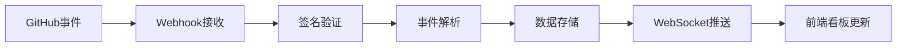
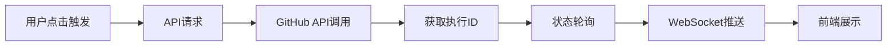

## 1. 产品概述

开发流水线状态可视化看板是一个面向研发团队的DevOps监控平台，通过集成GitHub Webhook和API，实时展示代码仓库的Pull Request状态、CI/CD流水线执行情况、测试覆盖率趋势以及部署统计数据，帮助团队快速识别流水线瓶颈，提升交付效率。

- 核心价值：将分散的GitHub事件（PR、CI、部署）聚合到统一可视化面板，实现开发全流程可观测
- 目标用户：研发团队、DevOps工程师、技术负责人

## 2. 核心特性

### 2.1 用户角色

| 角色 | 注册方式 | 核心权限 |
|------|----------|----------|
| 团队成员 | GitHub OAuth登录 | 查看所有看板数据、触发工作流 |
| 管理员 | GitHub OAuth登录（组织权限） | 配置Webhook、管理仓库接入、查看统计 |

### 2.2 功能模块

1. **看板主页**：仓库分组PR列表、CI状态内联展示、代码审查意见、合并状态
2. **流水线视图**：分阶段展示（构建→测试→部署）、执行状态、耗时统计、实时更新
3. **覆盖率趋势**：测试覆盖率历史图表、按分支汇总展示
4. **工作流触发**：一键触发指定GitHub Actions工作流、实时同步执行状态
5. **统计分析**：部署频率、成功率、按仓库和时间范围筛选

### 2.3 页面详情

| 页面名称 | 模块名称 | 功能描述 |
|----------|----------|----------|
| 看板主页 | 仓库分组PR列表 | 按仓库分组展示最近PR，支持折叠/展开，显示PR标题、作者、分支、创建时间 |
| 看板主页 | PR状态卡片 | 内联显示CI检查状态（通过/失败/进行中）、代码审查意见（批准/请求变更/评论数）、合并状态 |
| 看板主页 | 实时更新指示器 | WebSocket连接状态、新事件通知徽章 |
| 流水线视图 | 阶段时间线 | 水平时间线展示构建→测试→部署各阶段，每个阶段显示步骤列表和执行状态 |
| 流水线视图 | 步骤详情 | 点击步骤查看执行日志摘要、开始/结束时间、耗时 |
| 流水线视图 | 实时推送 | 流水线状态变化自动更新，无需刷新页面 |
| 覆盖率趋势 | 历史图表 | 折线图展示测试覆盖率随时间变化趋势，支持多分支对比 |
| 覆盖率趋势 | 分支筛选 | 下拉选择特定分支或查看全部分支汇总 |
| 工作流触发 | 工作流列表 | 展示仓库可用的GitHub Actions工作流，显示最近执行状态 |
| 工作流触发 | 一键触发 | 点击按钮触发指定工作流（如重新部署），支持输入参数 |
| 工作流触发 | 执行状态同步 | 触发后实时轮询+WebSocket推送执行状态 |
| 统计分析 | 部署频率 | 柱状图展示指定时间范围内各仓库的部署次数 |
| 统计分析 | 成功率 | 环形图展示部署成功率，失败原因分类统计 |
| 统计分析 | 时间筛选 | 日期范围选择器、预设快捷选项（本周/本月/本季度） |
| 统计分析 | 仓库筛选 | 多选仓库进行对比分析 |

## 3. 核心流程

### 3.1 事件接收流程

用户提交代码→GitHub触发Webhook→后端服务接收并验证签名→解析事件类型（Push/PR/Actions）→更新数据库→WebSocket推送至前端→看板实时更新

### 3.2 工作流触发流程

用户在看板点击触发按钮→前端调用API→后端使用GitHub Token调用Actions API→返回执行ID→实时轮询执行状态→WebSocket推送进度→前端展示执行结果

## 4. 用户界面设计

### 4.1 设计风格

采用工业风/科技感深色主题，突出流水线状态的视觉辨识度
- **主色调**：深靛蓝 #1e3a5f 作为背景主色，配合电光蓝 #3b82f6 作为强调色
- **状态色**：成功 #10b981（翠绿）、失败 #ef4444（赤红）、进行中 #f59e0b（琥珀黄）、等待 #6b7280（灰）
- **字体**：展示字体使用 Space Grotesk，正文字体使用 JetBrains Mono（等宽字体体现技术感）
- **布局**：卡片式布局，辅以微妙的渐变边框和发光效果
- **图标**：使用 Lucide React 图标库，线性风格
- **动效**：状态变化时使用脉冲动画，流水线进度使用流动光效

### 4.2 页面设计概述

| 页面名称 | 模块名称 | UI元素 |
|----------|----------|--------|
| 看板主页 | 仓库分组PR列表 | 手风琴式分组、卡片悬浮阴影、状态徽标发光效果 |
| 看板主页 | PR状态卡片 | 网格布局、CI状态进度条、审查意见头像堆叠、合并按钮 |
| 流水线视图 | 阶段时间线 | 水平阶梯布局、连接线流动动画、步骤状态图标、耗时标签 |
| 流水线视图 | 步骤详情 | 抽屉式面板、代码块日志展示、时间戳 |
| 覆盖率趋势 | 历史图表 | 平滑曲线折线图、渐变填充、交互式tooltip |
| 工作流触发 | 触发面板 | 玻璃拟态卡片、发光按钮、执行进度条 |
| 统计分析 | 数据图表 | 组合图表、数据钻取、导出按钮 |

### 4.3 响应式

- 桌面端（>1200px）：侧边导航 + 多列网格布局
- 平板端（768-1200px）：顶部导航 + 双列布局
- 移动端（<768px）：底部导航 + 单列瀑布流，图表可横向滚动

### 4.4 动效细节

- 页面加载：分模块交错淡入，流水线元素从左到右依次出现
- 状态变更：颜色渐变过渡 + 脉冲波纹效果
- 鼠标悬停：卡片轻微上浮 + 阴影加深
- 实时更新：新事件从顶部滑入，旧事件平滑下移
