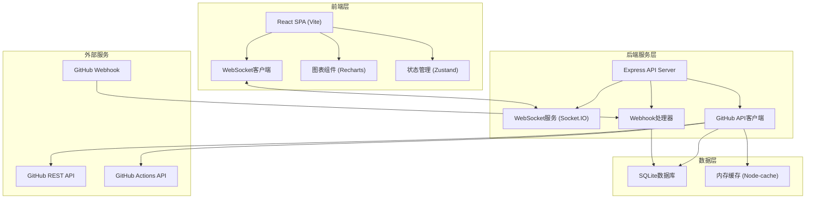
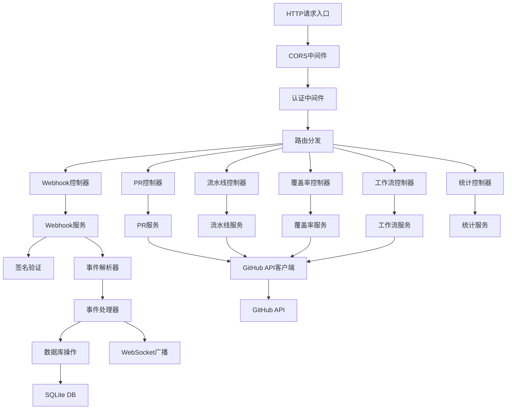
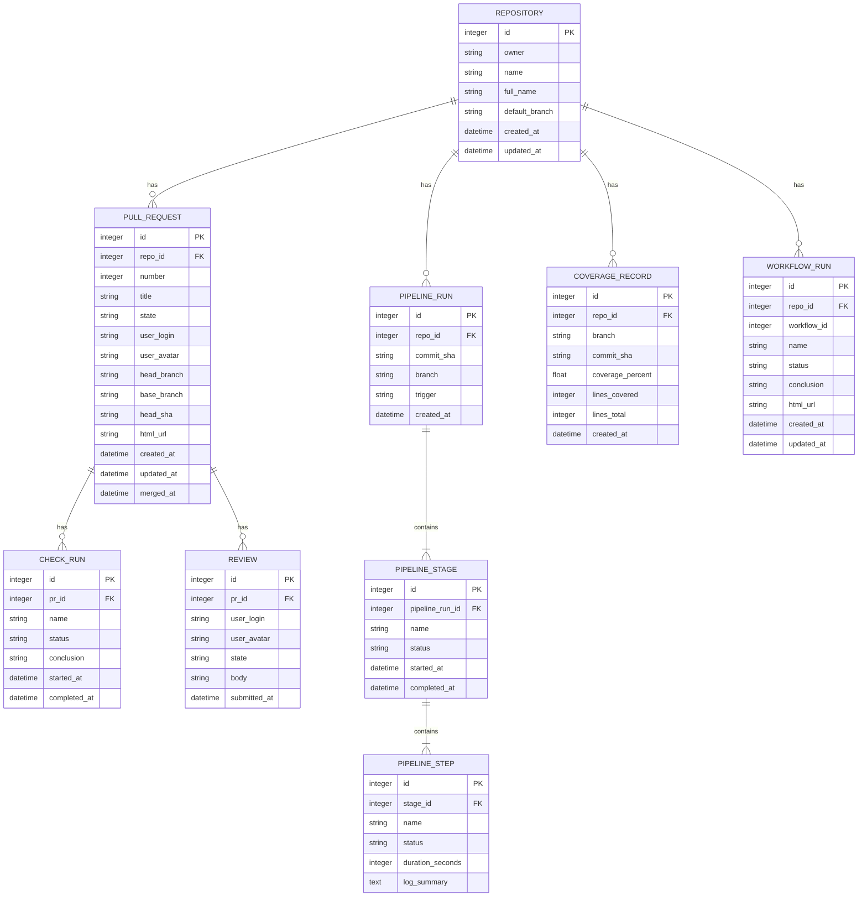

## 1. 架构设计



## 2. 技术栈描述

- **前端框架**：React@18 + TypeScript
- **构建工具**：Vite@5
- **样式方案**：TailwindCSS@3 + CSS Variables
- **状态管理**：Zustand（轻量级状态管理）
- **图表库**：Recharts@2（React图表组件）
- **路由**：React Router@6
- **图标**：Lucide React
- **实时通信**：Socket.IO Client
- **HTTP客户端**：Axios
- **后端**：Express@4 + TypeScript
- **WebSocket服务**：Socket.IO
- **数据库**：SQLite3 + better-sqlite3
- **GitHub集成**：Octokit（GitHub官方SDK）
- **缓存**：Node-cache
- **进程管理**：concurrently（前后端并行开发）

## 3. 路由定义

### 前端路由

| 路由路径 | 页面名称 | 说明 |
|----------|----------|------|
| / | 看板主页 | 仓库分组PR列表展示 |
| /pipeline/:repo? | 流水线视图 | 分阶段展示CI/CD执行状态 |
| /coverage | 覆盖率趋势 | 测试覆盖率历史图表 |
| /workflows | 工作流触发 | 展示和触发GitHub Actions |
| /statistics | 统计分析 | 部署频率和成功率统计 |
| /settings | 系统设置 | Webhook配置、GitHub Token设置 |

### 后端API路由

| 方法 | 路径 | 用途 |
|------|------|------|
| POST | /api/webhook/github | 接收GitHub Webhook事件 |
| GET | /api/repos | 获取已配置的仓库列表 |
| GET | /api/repos/:owner/:name/prs | 获取仓库PR列表 |
| GET | /api/repos/:owner/:name/prs/:number | 获取PR详情 |
| GET | /api/repos/:owner/:name/pipelines | 获取流水线执行历史 |
| GET | /api/repos/:owner/:name/coverage | 获取测试覆盖率数据 |
| GET | /api/repos/:owner/:name/workflows | 获取可用工作流列表 |
| POST | /api/repos/:owner/:name/workflows/:id/dispatch | 触发工作流执行 |
| GET | /api/repos/:owner/:name/workflows/runs/:runId | 获取工作流执行状态 |
| GET | /api/statistics/deployments | 获取部署统计数据 |
| GET | /api/statistics/success-rate | 获取成功率统计 |

## 4. API类型定义

```typescript
// 核心数据类型定义

interface Repository {
  id: number;
  owner: string;
  name: string;
  fullName: string;
  description: string;
  htmlUrl: string;
  defaultBranch: string;
  createdAt: string;
  updatedAt: string;
}

interface PullRequest {
  id: number;
  number: number;
  title: string;
  body: string;
  state: 'open' | 'closed' | 'merged';
  htmlUrl: string;
  user: GitHubUser;
  base: { ref: string; sha: string };
  head: { ref: string; sha: string };
  createdAt: string;
  updatedAt: string;
  mergedAt: string | null;
  mergeable: boolean | null;
  ciStatus: CIStatus;
  reviews: Review[];
}

interface CIStatus {
  state: 'pending' | 'success' | 'failure' | 'running';
  totalChecks: number;
  passedChecks: number;
  failedChecks: number;
  checks: CheckRun[];
}

interface CheckRun {
  id: number;
  name: string;
  status: 'queued' | 'in_progress' | 'completed';
  conclusion: 'success' | 'failure' | 'neutral' | 'cancelled' | 'skipped' | 'timed_out' | 'action_required' | null;
  startedAt: string | null;
  completedAt: string | null;
  durationSeconds: number | null;
}

interface Review {
  id: number;
  user: GitHubUser;
  state: 'approved' | 'changes_requested' | 'commented' | 'dismissed';
  body: string;
  submittedAt: string;
}

interface GitHubUser {
  id: number;
  login: string;
  avatarUrl: string;
  htmlUrl: string;
}

interface PipelineStage {
  id: string;
  name: 'build' | 'test' | 'deploy';
  status: 'pending' | 'running' | 'success' | 'failed' | 'skipped';
  startedAt: string | null;
  completedAt: string | null;
  durationSeconds: number | null;
  steps: PipelineStep[];
}

interface PipelineStep {
  id: string;
  name: string;
  status: 'pending' | 'running' | 'success' | 'failed' | 'skipped';
  startedAt: string | null;
  completedAt: string | null;
  durationSeconds: number | null;
  logSummary: string | null;
}

interface CoverageData {
  id: number;
  repoId: number;
  branch: string;
  commitSha: string;
  coveragePercent: number;
  linesCovered: number;
  linesTotal: number;
  createdAt: string;
}

interface Workflow {
  id: number;
  name: string;
  path: string;
  state: 'active' | 'disabled';
  htmlUrl: string;
  badgeUrl: string;
  lastRun: WorkflowRun | null;
}

interface WorkflowRun {
  id: number;
  name: string;
  status: 'queued' | 'in_progress' | 'completed';
  conclusion: 'success' | 'failure' | 'neutral' | 'cancelled' | 'skipped' | 'timed_out' | 'action_required' | null;
  htmlUrl: string;
  createdAt: string;
  updatedAt: string;
}

interface DeploymentStats {
  repoId: number;
  repoName: string;
  period: string;
  deploymentCount: number;
  successCount: number;
  failureCount: number;
  successRate: number;
  averageDurationSeconds: number;
}

// WebSocket事件类型
type WSEvent = 
  | { type: 'pr:updated'; data: PullRequest }
  | { type: 'pipeline:updated'; data: PipelineStage[] }
  | { type: 'workflow:updated'; data: WorkflowRun }
  | { type: 'deployment:completed'; data: DeploymentStats };
```

## 5. 后端服务架构



## 6. 数据模型

### 6.1 实体关系图



### 6.2 DDL语句

```sql
-- 仓库表
CREATE TABLE IF NOT EXISTS repositories (
  id INTEGER PRIMARY KEY AUTOINCREMENT,
  owner TEXT NOT NULL,
  name TEXT NOT NULL,
  full_name TEXT NOT NULL UNIQUE,
  description TEXT,
  default_branch TEXT NOT NULL,
  html_url TEXT,
  created_at DATETIME DEFAULT CURRENT_TIMESTAMP,
  updated_at DATETIME DEFAULT CURRENT_TIMESTAMP
);

CREATE INDEX idx_repos_full_name ON repositories(full_name);

-- PR表
CREATE TABLE IF NOT EXISTS pull_requests (
  id INTEGER PRIMARY KEY,
  repo_id INTEGER NOT NULL,
  number INTEGER NOT NULL,
  title TEXT NOT NULL,
  body TEXT,
  state TEXT NOT NULL,
  user_login TEXT NOT NULL,
  user_avatar TEXT,
  head_branch TEXT NOT NULL,
  base_branch TEXT NOT NULL,
  head_sha TEXT NOT NULL,
  html_url TEXT,
  mergeable INTEGER,
  created_at DATETIME NOT NULL,
  updated_at DATETIME NOT NULL,
  merged_at DATETIME,
  FOREIGN KEY (repo_id) REFERENCES repositories(id),
  UNIQUE(repo_id, number)
);

CREATE INDEX idx_prs_repo_id ON pull_requests(repo_id);
CREATE INDEX idx_prs_state ON pull_requests(state);

-- Check Run表
CREATE TABLE IF NOT EXISTS check_runs (
  id INTEGER PRIMARY KEY,
  pr_id INTEGER NOT NULL,
  name TEXT NOT NULL,
  status TEXT NOT NULL,
  conclusion TEXT,
  started_at DATETIME,
  completed_at DATETIME,
  duration_seconds INTEGER,
  FOREIGN KEY (pr_id) REFERENCES pull_requests(id)
);

CREATE INDEX idx_check_runs_pr_id ON check_runs(pr_id);

-- Review表
CREATE TABLE IF NOT EXISTS reviews (
  id INTEGER PRIMARY KEY,
  pr_id INTEGER NOT NULL,
  user_login TEXT NOT NULL,
  user_avatar TEXT,
  state TEXT NOT NULL,
  body TEXT,
  submitted_at DATETIME NOT NULL,
  FOREIGN KEY (pr_id) REFERENCES pull_requests(id)
);

CREATE INDEX idx_reviews_pr_id ON reviews(pr_id);

-- 流水线运行表
CREATE TABLE IF NOT EXISTS pipeline_runs (
  id INTEGER PRIMARY KEY AUTOINCREMENT,
  repo_id INTEGER NOT NULL,
  commit_sha TEXT NOT NULL,
  branch TEXT NOT NULL,
  trigger TEXT,
  created_at DATETIME DEFAULT CURRENT_TIMESTAMP,
  FOREIGN KEY (repo_id) REFERENCES repositories(id)
);

CREATE INDEX idx_pipelines_repo_id ON pipeline_runs(repo_id);
CREATE INDEX idx_pipelines_branch ON pipeline_runs(branch);

-- 流水线阶段表
CREATE TABLE IF NOT EXISTS pipeline_stages (
  id INTEGER PRIMARY KEY AUTOINCREMENT,
  pipeline_run_id INTEGER NOT NULL,
  name TEXT NOT NULL,
  status TEXT NOT NULL,
  started_at DATETIME,
  completed_at DATETIME,
  duration_seconds INTEGER,
  FOREIGN KEY (pipeline_run_id) REFERENCES pipeline_runs(id)
);

-- 流水线步骤表
CREATE TABLE IF NOT EXISTS pipeline_steps (
  id INTEGER PRIMARY KEY AUTOINCREMENT,
  stage_id INTEGER NOT NULL,
  name TEXT NOT NULL,
  status TEXT NOT NULL,
  started_at DATETIME,
  completed_at DATETIME,
  duration_seconds INTEGER,
  log_summary TEXT,
  FOREIGN KEY (stage_id) REFERENCES pipeline_stages(id)
);

-- 覆盖率记录表
CREATE TABLE IF NOT EXISTS coverage_records (
  id INTEGER PRIMARY KEY AUTOINCREMENT,
  repo_id INTEGER NOT NULL,
  branch TEXT NOT NULL,
  commit_sha TEXT NOT NULL,
  coverage_percent REAL NOT NULL,
  lines_covered INTEGER NOT NULL,
  lines_total INTEGER NOT NULL,
  created_at DATETIME DEFAULT CURRENT_TIMESTAMP,
  FOREIGN KEY (repo_id) REFERENCES repositories(id)
);

CREATE INDEX idx_coverage_repo_branch ON coverage_records(repo_id, branch);

-- 工作流运行表
CREATE TABLE IF NOT EXISTS workflow_runs (
  id INTEGER PRIMARY KEY,
  repo_id INTEGER NOT NULL,
  workflow_id INTEGER NOT NULL,
  name TEXT NOT NULL,
  status TEXT NOT NULL,
  conclusion TEXT,
  html_url TEXT,
  created_at DATETIME NOT NULL,
  updated_at DATETIME NOT NULL,
  FOREIGN KEY (repo_id) REFERENCES repositories(id)
);

CREATE INDEX idx_workflow_runs_repo_id ON workflow_runs(repo_id);

-- 配置表
CREATE TABLE IF NOT EXISTS config (
  key TEXT PRIMARY KEY,
  value TEXT,
  updated_at DATETIME DEFAULT CURRENT_TIMESTAMP
);

-- 初始数据
INSERT OR IGNORE INTO config (key, value) VALUES 
('github_token', ''),
('webhook_secret', ''),
('repos', '[]');
```
